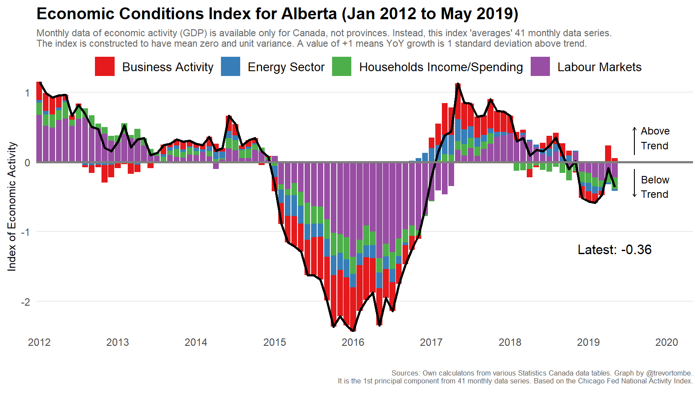

# Constructs Monthly Index of Economic Conditions in Alberta

There are three R files necessary to construct the Economic Conditions Index. First "core.R" loads packages, functions, themes, and other useful objectives. Some of this isn't strictly necessary, but I use it elsewhere. Second, "ECI_data.R" downloads the processes the necessary data from various sources. Third, "ECI.R" estimates the first principle component from this data and generates the visualization.

The end result is

